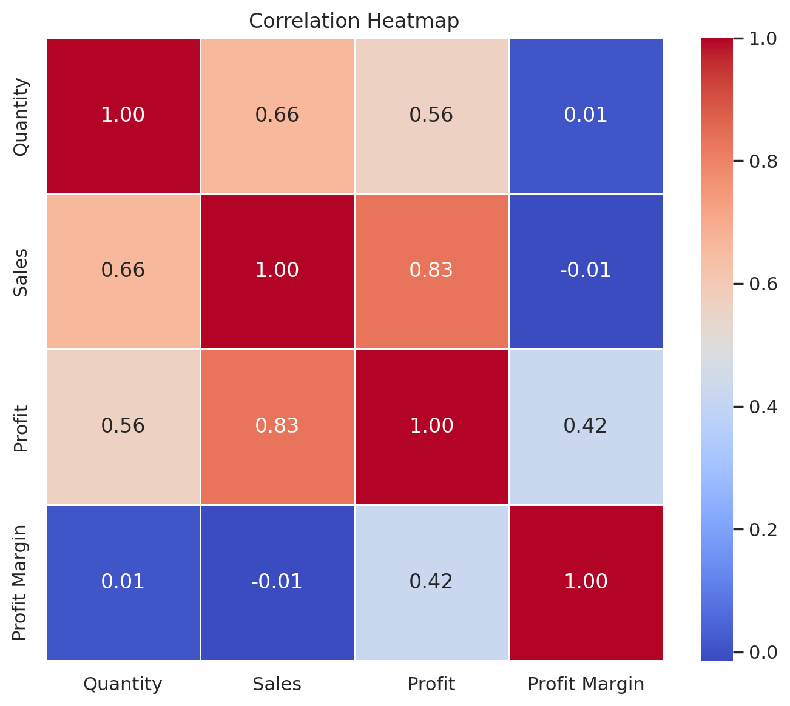
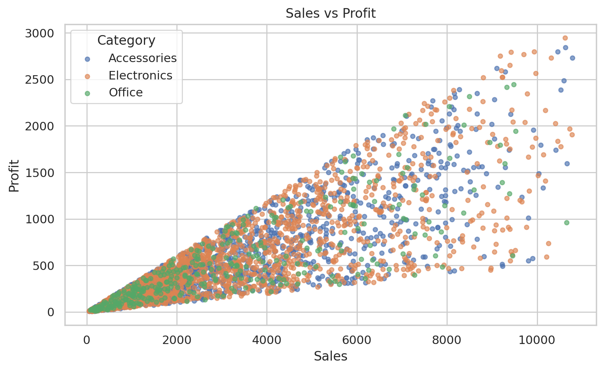
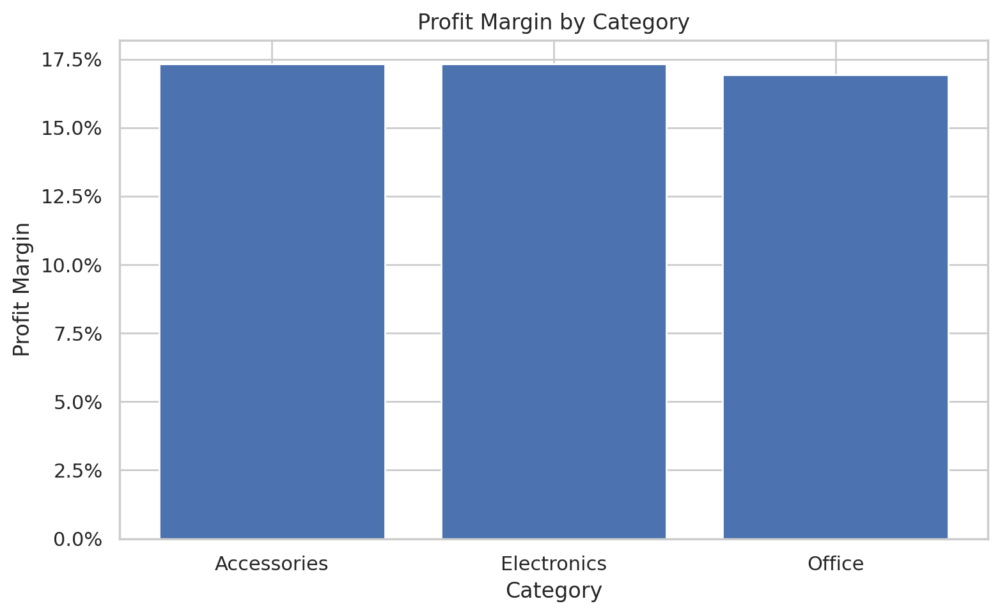
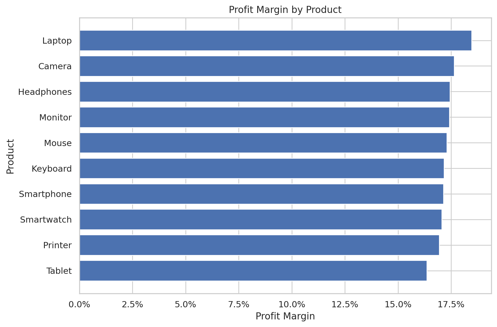
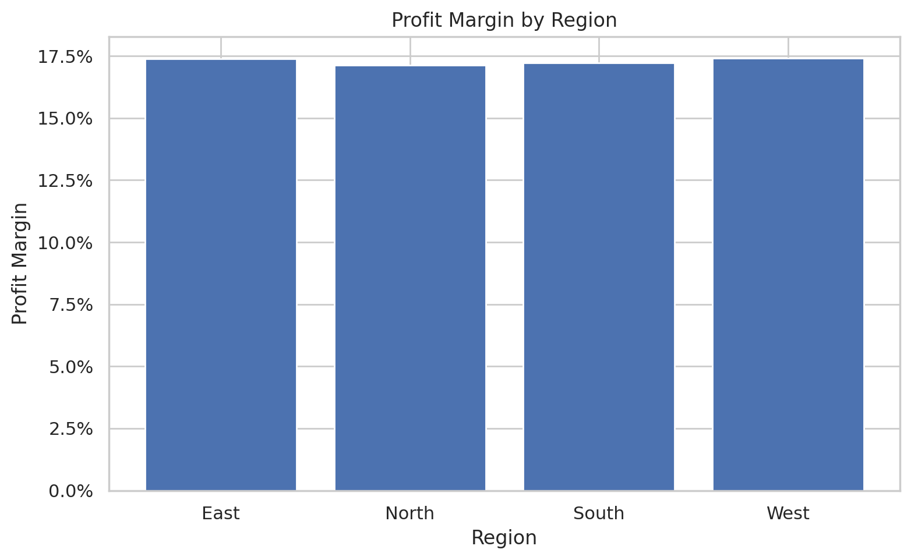
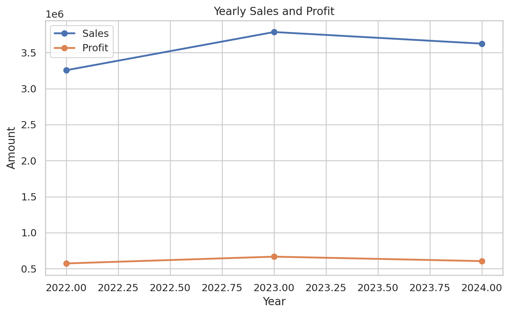

<div align="center">

# 🛒 E-Commerce Profit Analysis

### Exploratory analysis of sales, profit, and margin performance using Python


</div>

---

# 📖 Project Overview

This project presents a complete exploratory data analysis of `ecommerce_sales_data.csv`.

The goal was to study sales, profit, and profitability patterns across products, categories, and regions, then identify a major business problem and provide data-backed recommendations.

---

# 🎯 Business Problem

**Why do some products and categories generate weaker profit margins even when sales remain strong?**

---

# 📂 Dataset

The dataset contains **3,500 rows** and **9 columns**:

- Order Date
- Product Name
- Products
- Category
- Product_Category
- Region
- Quantity
- Sales
- Profit

The CSV is included in the repository under the `data/` folder.

---

# 🛠 Technologies Used

- Python
- Pandas
- NumPy
- Matplotlib
- Seaborn
- Jupyter Notebook
- HTML
- Microsoft Word
- Git
- GitHub

---

# 📁 Project Structure

```text
E-Commerce-Profit-Analysis
│
├── data
├── images
├── notebooks
├── reports
├── README.md
├── requirements.txt
└── .gitignore
```

---

# 📓 Analysis Notebook

➡️ **[Open the Jupyter Notebook](notebooks/Ecommerce_Profit_Analysis.ipynb)**

---

# 📊 Visualizations

## Correlation Heatmap



---

## Sales vs Profit



---

## Profit Margin by Category



---

## Profit Margin by Product



---

## Profit Margin by Region



---

## Yearly Sales and Profit Trend


---

# 🔍 Key Findings

- Total Sales: **$10,667,881**
- Total Profit: **$1,844,655**
- Average Profit Margin: **17.37%**
- Sales and Profit correlation: **0.833**
- Highest product margin: **Laptop (18.47%)**
- Lowest product margin: **Tablet (16.36%)**
- Lowest category margin: **Office (16.94%)**

---

# 💡 Recommendations

- Review pricing and cost structure for low-margin products.
- Prioritize higher-margin items in campaigns and bundles.
- Track margin by product, category, and region.
- Investigate the margin drop in 2024.
- Use profitability, not sales alone, for decision-making.

---

# 📄 Reports

- 📓 Jupyter Notebook
- 🌐 HTML Report
- 📄 Microsoft Word Report
- 📈 Charts and visualizations

---

# 👨‍💻 Author

**Princetova Toby-Diala**

If you found this project useful, feel free to ⭐ the repository.
